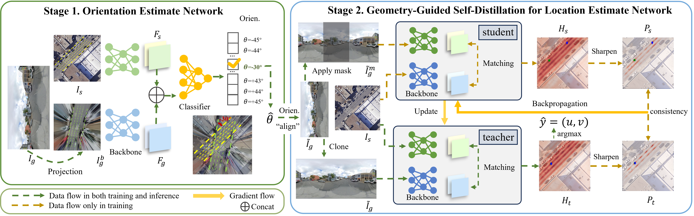

<h1 align="center"><strong>GeoDistill: Geometry-Guided Self-Distillation for Weakly Supervised Cross-View Localization</strong></h1>

<p align="center">
  <a href="https://arxiv.org/pdf/2507.10935" target='_blank'>
    
  </a> 
  <a href="https://arxiv.org/pdf/2507.10935" target='_blank'>
    
  </a>
  <a href="#citation">
    
  </a>
</p>

## 🏠 About



We introduce GeoDistill, a weakly supervised selfdistillation paradigm that enhances local discriminative feature learning for robust cross-view localization. We
demonstrate that this learning paradigm applies to different localization frameworks and improves their performance by over 10% without architectural modifications.
Furthermore, we demonstrate that while FoV-based masking as a naive data augmentation
impairs performance, it significantly improves the performance of localization frameworks when applied within
our proposed teacher-student self-distillation pipeline.
## 📦 Checkpoints
📁 [**Download pretrained models**](https://drive.google.com/drive/folders/1pPaECfpH3H1_hPc7bDbT2X7oZ5-_HyH9?usp=drive_link)


## 🚀 Training

### Set up

We train and test our codes under the following environment:

- Ubuntu 18.04
- CUDA 12.0
- Python 3.8.16
- PyTorch 1.13.0

To get started, follow these steps: 

#### Clone this repository.

```bash
git clone https://github.com/tongshw/GeoDistill.git
cd GeoDistill
```


### Training
We released our implementation of G2SWeakly and GeoDistill with G2SWeakly both VGG and DINO variants. 

**We apply mask in both ground image and feature maps when base model is G2SWeakly, and when use CCVPE as base model, we apply mask to the descriptor.**
```bash
# to train our implemented G2SWeakly in VIGOR cross area
python -u train_vigor.py --train True --train_g2sweakly True --cross_area True


# to train orientation estimator
python -u train_orientation.py --train True --cross_area True
```

## 🎉 Evaluation

### 2-DoF Evaluation

To evaluate the Geodistill model, follow these steps:

1. Download the [VIGOR](https://github.com/Jeff-Zilence/VIGOR) dataset and set its path to '/home/< usr >/Data/VIGOR'.
2. Download the [pretrained models](https://drive.google.com/drive/folders/1pPaECfpH3H1_hPc7bDbT2X7oZ5-_HyH9?usp=drive_link).
3. set 'model' in  dataset/config_vigor.json as your pth file path
4. Run the following command:

````bash
python -u train_vigor.py --train False --cross_area True
````


### 3-DoF Evaluation
set 'model' and 'orientation_model' in  dataset/config_vigor.json as your pth file path
````bash
python -u eval_3dof_vigor.py --cross_area True
````


<h2 id="citation">🔗 Citation</h2>

If you find our work helpful, please cite:

```bibtex
@misc{tong2025geodistillgeometryguidedselfdistillationweakly,
      title={GeoDistill: Geometry-Guided Self-Distillation for Weakly Supervised Cross-View Localization}, 
      author={Shaowen Tong and Zimin Xia and Alexandre Alahi and Xuming He and Yujiao Shi},
      year={2025},
      eprint={2507.10935},
      archivePrefix={arXiv},
      primaryClass={cs.CV},
      url={https://arxiv.org/abs/2507.10935}, 
}
```

## 👏 Acknowledgements

- This work is based on [G2SWeakly](https://github.com/yujiaoshi/g2sweakly) and [CCVPE](https://github.com/tudelft-iv/CCVPE), we thank the authors for the contribution.
